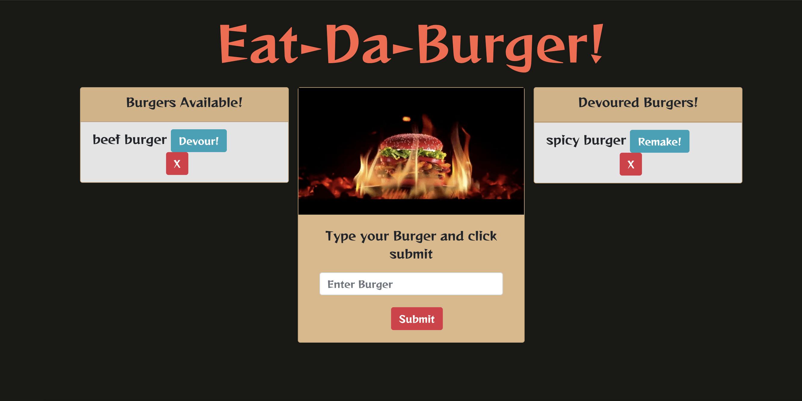

# Burger App  

## Description

It is a burger logger application that uses MySQL, Node, Express and Handlebars to generate the HTML. It also follow the MVC design pattern. 

## LINK TO THE REPOSITORY

-  [burger](https://github.com/LShuqair/burger)

## LINK TO Deployed App

-  [burger]()

## Screen-shot

